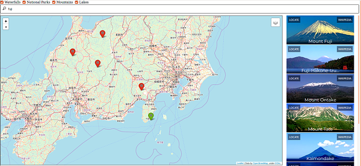
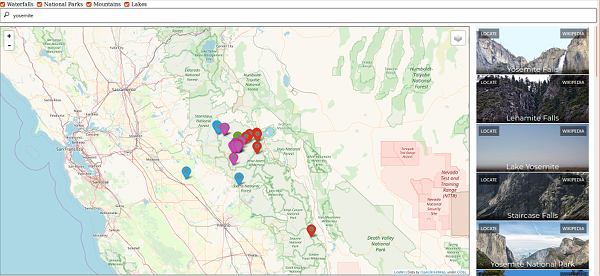

# GeoTravel: Folium-based Search Engine
## Web Data - Assignment 2 - WSU Vancouver
### Python 2/Flask/Whoosh/Folium/SQLite
### Abstract
GeoTravel is a minimalist search engine implemented in Python using various libraries like Whoosh for data indexing, Flask for database interfacing, and Jinja for dynamic web page building. The search engine displays results and information on *lakes, mountains, national parks,* and *waterfalls* as per the user’s query. The data collected in the backend database is scraped from **Wikipedia’s API** and parsed into four data tables built in **SQLite**, each containing information about their respective topics.

For more information, see the [pdf docs.](docs/CS483_FinalProposal.pdf)




### Requirements
Python 2
Imports: Whoosh, urllib, folium, sqlite3, jinja2, flask, beautifulsoup, requests

### Executing
*The webscrapper which websrapped Wikipedia has already constructed the database, images were added later to the database*
```sh
    ./flask_server.py
```
or
```sh
    python2 flask_server.py
```

** browser URL http://localhost:5000/ after execution. **
